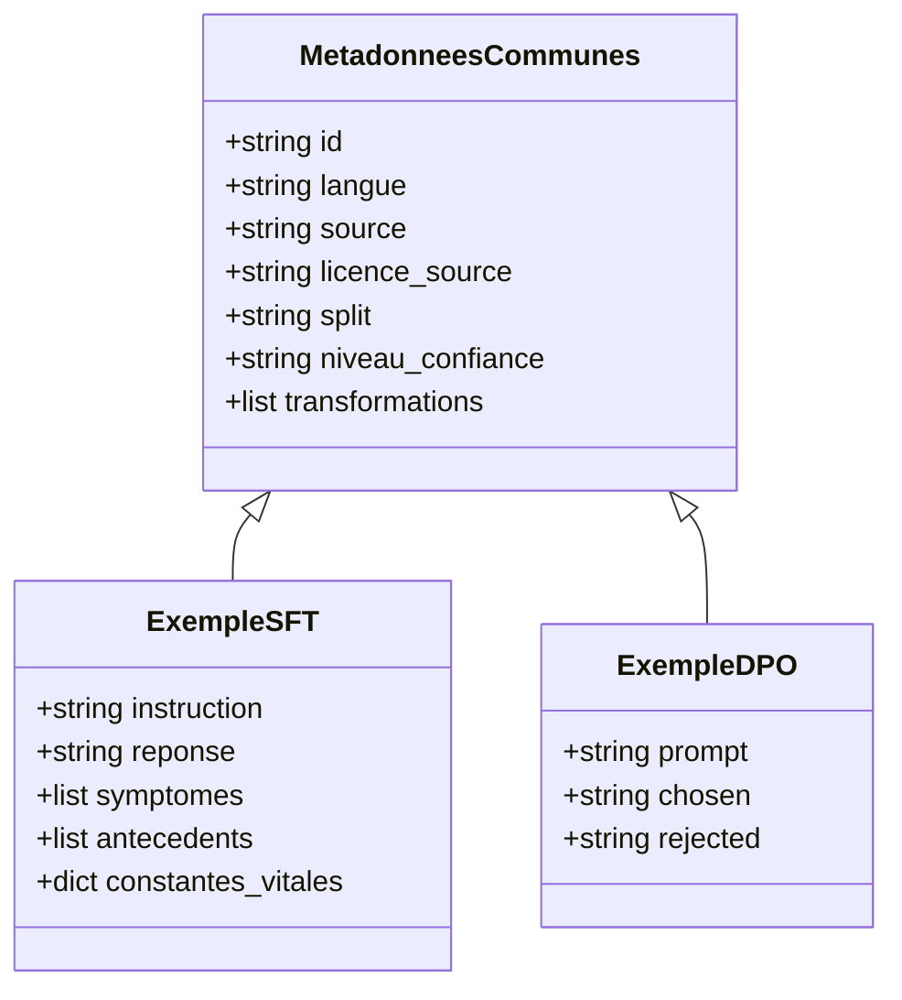

# Schéma de métadonnées

Ce document décrit la structure commune utilisée pour chaque exemple du dataset,
qu'il vienne du SFT ou du DPO. L'idée : au delà du texte de l'exemple, on garde
toujours de quoi savoir d'où il vient, dans quelle langue il est, quel niveau de
confiance on lui accorde, et quelles transformations lui ont été appliquées.

## Champs communs à tous les exemples

| Champ               | Type   | Description                                                          |
| -------------------------| -------| -----------------------------------------------------------------------|
| `id`                | string | Identifiant unique de l'exemple dans le dataset final |
| `langue`            | string | `fr` ou `en` |
| `source`            | string | Nom du dataset d'origine : `mediqal`, `frenchmedmcqa`, `medquad`, `ultramedical_preference` |
| `licence_source`    | string | Licence du dataset d'origine, voir `docs/sources.md` |
| `split`             | string | `train`, `validation`, `test` ou `eval_clinique` |
| `niveau_confiance`  | string | `haut`, `moyen`, `bas`, selon la fiabilité de l'annotation d'origine |
| `transformations`   | liste  | Historique des étapes appliquées à l'exemple (reformulation, anonymisation, etc.) |

## Calcul du niveau_confiance

Le critère repose sur deux éléments : la clarté de la licence de la source, et la
façon dont son contenu a été validé.

- **haut** : contenu d'origine humaine, validé sur un cas réel (cas clinique
  rédigé ou question d'examen avec correction), licence claire.
  - `mediqal` : cas cliniques rédigés par des professionnels, corpus de
    recherche validé (Bazoge et al., Scientific Data), licence CC-BY-4.0.
  - `frenchmedmcqa` : questions réelles de l'examen du diplôme de
    spécialisation en pharmacie, avec correction manuelle indiquée par les
    auteurs du papier, licence Apache 2.0 (voir `docs/sources.md`).
- **moyen** : contenu issu d'une source fiable, mais assemblé ou annoté de
  façon largement automatique, sans validation clinique propre à chaque
  exemple.
  - `medquad` : FAQ agrégées automatiquement depuis des sites d'organismes de
    santé publics (NIH), fiables sur le fond mais pas relues une à une pour
    ce projet.
  - `ultramedical_preference` : préférences annotées par GPT-4 puis révisées
    par des experts biomédicaux, mais sans vérification systématique exemple
    par exemple.
- **bas** : réservé aux sources sans licence claire ou sans validation
  identifiée. Aucune source du projet ne s'y trouve actuellement.

## Champs spécifiques au SFT

| Champ               | Type   | Description |
| ------------------- | ------ | ----------- |
| `instruction`       | string | La question ou consigne posée au modèle |
| `reponse`           | string | La réponse attendue |
| `symptomes`         | liste  | Symptômes mentionnés dans le cas, si présents |
| `antecedents`       | liste  | Antécédents médicaux mentionnés, si présents |
| `constantes_vitales`| objet  | Constantes relevées (FC, PA, FR, SpO2, température...), si présentes |

## Champs spécifiques au DPO

| Champ      | Type   | Description |
| ---------- | ------ | ----------- |
| `prompt`   | string | La situation ou question posée |
| `chosen`   | string | La réponse préférée |
| `rejected` | string | La réponse écartée |

## Vue d'ensemble

## À trancher

- Les champs `symptomes`, `antecedents` et `constantes_vitales` seront vides pour
  beaucoup d'exemples (MedQuAD et FrenchMedMCQA n'ont pas ce niveau de détail
  clinique). À décider : les laisser vides ou ne les extraire que quand la source
  le permet (MediQAl, qui a des cas cliniques rédigés).
