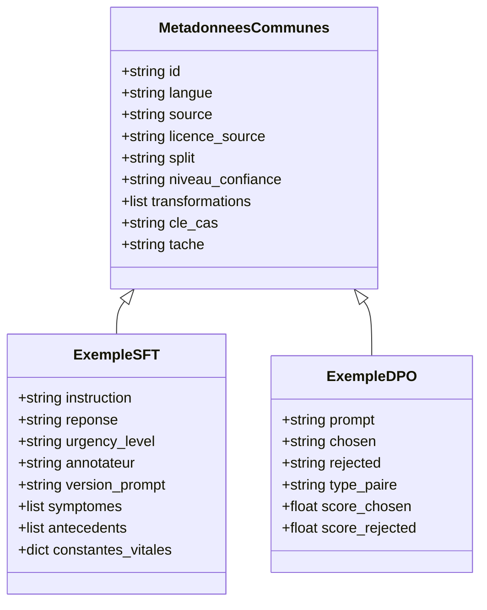

# Schéma de métadonnées

Ce document décrit la structure commune utilisée pour chaque exemple du dataset,
qu'il vienne du SFT ou du DPO. L'idée : au delà du texte de l'exemple, on garde
toujours de quoi savoir d'où il vient, dans quelle langue il est, quel niveau de
confiance on lui accorde, et quelles transformations lui ont été appliquées.

## Champs communs à tous les exemples

| Champ               | Type   | Description                                                          |
| -------------------------| -------| -----------------------------------------------------------------------|
| `id`                | string | Identifiant unique de l'exemple dans le dataset final |
| `langue`            | string | `fr` ou `en` |
| `source`            | string | Nom du dataset d'origine : `mediqal`, `frenchmedmcqa`, `medquad`, `ultramedical_preference` |
| `licence_source`    | string | Licence du dataset d'origine, voir `docs/sources.md` |
| `split`             | string | `train`, `validation` ou `test` |
| `niveau_confiance`  | string | `haut`, `moyen`, `bas`, selon la fiabilité de l'annotation d'origine |
| `transformations`   | liste  | Historique des étapes appliquées à l'exemple (reformulation, anonymisation, etc.) |
| `cle_cas`           | string | Clé du cas (100 premiers caractères du texte normalisé), pour le découpage et le contrôle de fuite |
| `tache`             | string | `triage` ou `qa` : dit quelle consigne ajouter devant le texte (`app/prompts.py`) |

## Calcul du niveau_confiance

Le critère repose sur deux éléments : la clarté de la licence de la source, et la
façon dont son contenu a été validé.

- **haut** : contenu d'origine humaine, validé sur un cas réel (cas clinique
  rédigé ou question d'examen avec correction), licence claire.
  - `mediqal` : cas cliniques rédigés par des professionnels, corpus de
    recherche validé (Bazoge et al., Scientific Data), licence CC-BY-4.0.
  - `frenchmedmcqa` : questions réelles de l'examen du diplôme de
    spécialisation en pharmacie, avec correction manuelle indiquée par les
    auteurs du papier, licence Apache 2.0 (voir `docs/sources.md`).
- **moyen** : contenu issu d'une source fiable, mais assemblé ou annoté de
  façon largement automatique, sans validation clinique propre à chaque
  exemple.
  - `medquad` : FAQ agrégées automatiquement depuis des sites d'organismes de
    santé publics (NIH), fiables sur le fond mais pas relues une à une pour
    ce projet.
  - `ultramedical_preference` : préférences annotées par GPT-4 puis révisées
    par des experts biomédicaux, mais sans vérification systématique exemple
    par exemple.
- **bas** : réservé aux sources sans licence claire ou sans validation
  identifiée. Aucune source du projet ne s'y trouve actuellement.

## Champs spécifiques au SFT

| Champ               | Type   | Description |
| ------------------- | ------ | ----------- |
| `instruction`       | string | Le cas de patient (triage) ou la question (qa), sans consigne |
| `reponse`           | string | La réponse attendue : JSON de triage, ou texte libre pour le QA |
| `urgency_level`     | string | Niveau d'urgence attendu (triage), vide pour le QA |
| `annotateur`        | string | Modèle qui a produit le label de triage, vide pour le QA |
| `version_prompt`    | string | Version de la consigne d'annotation, vide pour le QA |
| `symptomes`         | liste  | Symptômes mentionnés dans le cas, si présents |
| `antecedents`       | liste  | Antécédents médicaux mentionnés, si présents |
| `constantes_vitales`| objet  | Constantes relevées (FC, PA, FR, SpO2, température...), si présentes |

## Champs spécifiques au DPO

| Champ      | Type   | Description |
| ---------- | ------ | ----------- |
| `prompt`   | string | La situation ou question posée |
| `chosen`   | string | La réponse préférée |
| `rejected` | string | La réponse écartée |
| `type_paire` | string | Construction de la paire dans la source : `hard`, `length`, `easy`, `human` |
| `score_chosen` | nombre | Note sur 5 de la réponse préférée |
| `score_rejected` | nombre | Note sur 5 de la réponse écartée |

## Vue d'ensemble

```mermaid
classDiagram
    class MetadonneesCommunes {
        +string id
        +string langue
        +string source
        +string licence_source
        +string split
        +string niveau_confiance
        +list transformations
        +string cle_cas
        +string tache
    }
    class ExempleSFT {
        +string instruction
        +string reponse
        +string urgency_level
        +string annotateur
        +string version_prompt
        +list symptomes
        +list antecedents
        +dict constantes_vitales
    }
    class ExempleDPO {
        +string prompt
        +string chosen
        +string rejected
        +string type_paire
        +float score_chosen
        +float score_rejected
    }
    MetadonneesCommunes <|-- ExempleSFT
    MetadonneesCommunes <|-- ExempleDPO
```

## Champs cliniques vides pour FrenchMedMCQA et MedQuAD

Depuis le passage au triage, ces champs sont remplis seulement pour les exemples de
triage : l'annotateur (Mistral Large) les extrait du cas en même temps que le label, et
laisse un champ vide quand le cas n'en parle pas. Ils restent vides pour tous les
exemples de QA, MediQAl compris. Le paragraphe suivant explique le choix d'origine.

Les champs `symptomes`, `antecedents` et `constantes_vitales` restent vides pour
FrenchMedMCQA et MedQuAD : ces sources n'ont pas le niveau de détail clinique
nécessaire pour les remplir. Question posée au mentor le 11 septembre 2026 mais
restée sans réponse tranchée, donc choix retenu par défaut : c'est l'option la
plus simple et elle ne perd aucune information puisque ces sources ne
permettaient de toute façon pas une extraction fiable. Une extraction
automatique pour MedQuAD reste envisageable comme amélioration future.
